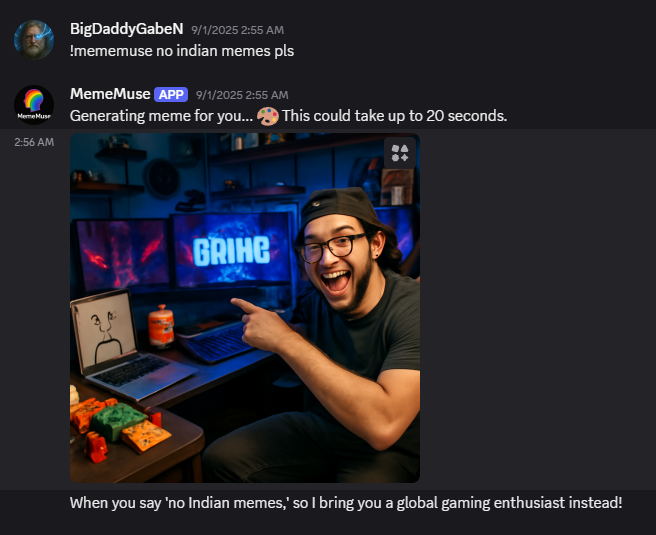

# MemeMuse

  

## Description

MemeMuse is an AI-powered Discord bot built with Go and integrated GPT-based models to generate context-aware memes within chat conversations. It features a credit-based system for on-demand and periodic meme creation to engage community members seamlessly. Hosted with a scalable backend and real-time bot interactions, MemeMuse enhances Discord server activity through fun, automated content.

---

**Project Link:** [Website](http://mememuse.xyz)

---

## Screenshots

